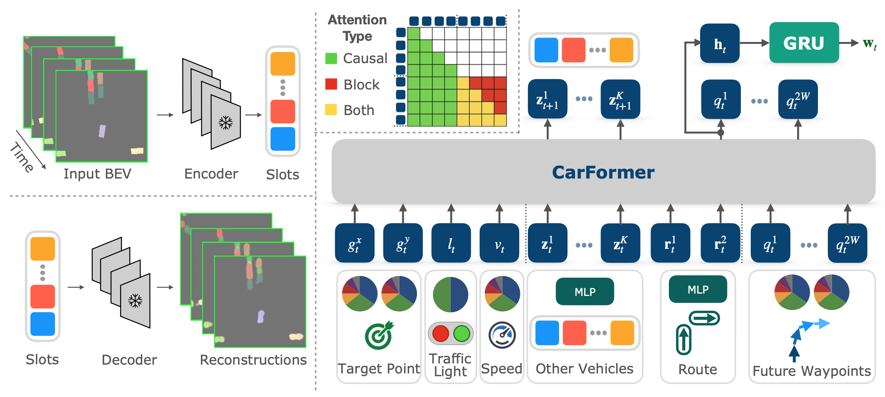
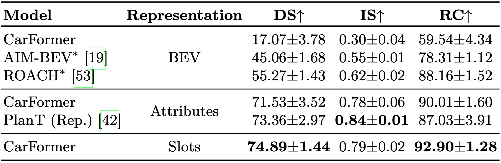
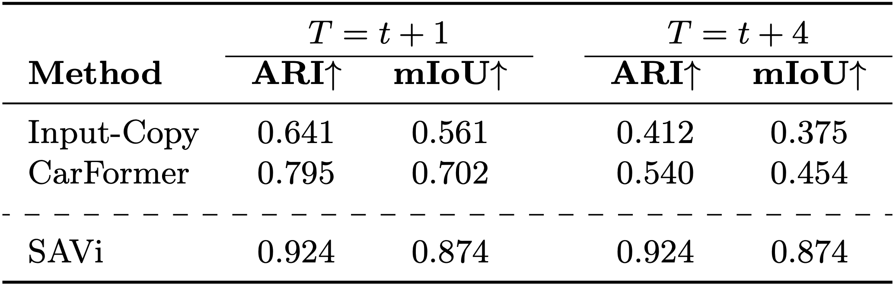

# CarFormer: Self-Driving with Learned Object-Centric Representations


The choice of representation plays a key role in self-driving. Bird’s eye view (BEV) representations have shown remarkable performance in recent years. In this paper, we propose to learn object-centric representations in BEV to distill a complex scene into more actionable information for self-driving. We first learn to place objects into slots with a slot attention model on BEV sequences. Based on these object-centric representations, we then train a transformer to learn to drive as well as reason about the future of other vehicles. We found that object-centric slot representations outperform both scene-level and object-level approaches that use the exact attributes of objects. Slot representations naturally incorporate information about objects from their spatial and temporal context such as position, heading, and speed without explicitly providing it. Our model with slots achieves an increased completion rate of the provided routes and, consequently, a higher driving score, with a lower variance across multiple runs, affirming slots as a reliable alternaive in object-centric approaches. Additionally, we validate our model’s performance as a world model through forecasting experiments, demonstrating its capability to accurately predict future slot representations.



---

## 🚗 Demo

https://github.com/user-attachments/assets/2cd76957-fc6b-4a35-bc14-500708a767a1


## Code Release

### Checklist

- [] Data Collection code
- [x] Training code 
- [x] Evaluation code
- [] Overall Polishing
- [] All Checkpoints


### Replicating Experiments

#### Data Collection

Follow the same steps as in the [PlanT repository](https://github.com/autonomousvision/plant) to collect the data. Replace the agent with the one provided in this repository.

#### Training

##### With Slots as Scene Representation

We release the pretrained SaVI model with 7, 14, and 30 slots. To train the model with 7/14/30 slots, run the following command:

```bash
torchrun --nproc_per_node=8 train_hydra.py training=quantized training/bev=bevslotsroute amp=True +experiments=[bevslotsforecast,blockattn] hyperparams.batch_size=64 hyperparams.num_epochs=120 training.forecast_steps=4 training.loss_params.state.forecast=50 dataset.subsample_ratio=1  training.loss_params.action.softf1=0 num_slots=SLOTS user=USERNAME gpus=8 dataset.dataset_path_rel=PATH_TO_DATASET
```

- Replace USER with your configuration name, which is under carformer/config/user/USER.yaml.
- GPUS, PATH_TO_DATASET, SLOTS replace with needed parameters. However, in our experiments we use 8 GPUs, so adjust batch size accordingly.

##### Object Level Scene Representation (PlanT-style)

```bash
torchrun --nproc_per_node=4 train_hydra.py training=quantized training/bev=bevobject amp=True +experiments=[blockattn] hyperparams.batch_size=128 hyperparams.num_epochs=120 training.forecast_steps=4 training.loss_params.state.forecast=1 dataset.subsample_ratio=1 training.loss_params.action.softf1=0 num_workers=10 user=USERNAME gpus=4 dataset.dataset_path_rel=PATH_TO_DATASET
```


#### Evaluation

After downloading the pretrained models, run the following command to evaluate the model on longest6:

```bash
python leaderboard/scripts/run_evaluation.py user=USERNAME port=PORT trafficManagerPort=TPORT experiments=Carformer eval=longest6 experiments.use_gru_output=True experiments.enlarge_small_vehicles=False experiments.use_creep=True experiments.wanderer_model_name=MODELNAME experiments.epoch_num=best eval.route_rel=leaderboard/data/longest6/longest6.xml experiments.agent_root=CKPTPATH
```

## Evaluation Results 

### Closed-Loop Evaluation on Longest6


### Forecasting BEV 


## 🗓️ TODOs

- [ ] Release code for training (Slots, Attributes)
- [ ] Release code for agent/evaluation (Slots, Attributes)
- [ ] Release pretrained checkpoints

## 🎫 License

This project is released under the [MIT license](LICENSE). 

## 🖊️ Citation

If you find this project useful in your research, or if you reuse the code for other purposes, please consider citing:

```BibTeX
@inProceedings{Hamdan2024ECCV,
      title={{CarFormer}: Self-Driving with Learned Object-Centric Representations}, 
      author={Shadi Hamdan and Fatma Güney},
      year={2024},
      booktitle={ECCV}
}
```

## Acknowledgments
This repository incorporates code from several public works, including [PlanT](https://github.com/autonomousvision/plant). Special thanks to the authors of these projects for making their code available.